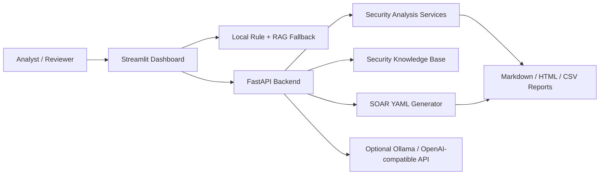

# Security LLM Platform

SOC-oriented AI security analysis platform with RAG, SOAR playbook generation, ATT&CK mapping, FastAPI backend, and Streamlit dashboard.

> Portfolio positioning: this is a defensive security AI demo designed to show product thinking, backend API design, RAG-assisted analysis, and operational security workflows. It runs locally by default and does not require a deployed LLM.

## Highlights

- **SOC AI command center**: Streamlit dashboard for threat posture, module navigation, incident state, and report export.
- **Defensive log analysis**: identifies SSH brute force, SQL injection, port scanning, suspicious C2-like traffic, and IOC indicators.
- **RAG-assisted answers**: combines a local security knowledge base with rule-based prompt templates; optional Ollama or OpenAI-compatible API integration is supported.
- **SOAR playbook generation**: converts natural-language response requirements into YAML playbooks with manual approval for risky actions.
- **ATT&CK mapping**: maps observed behavior to MITRE ATT&CK-style techniques for cleaner incident reporting.
- **FastAPI backend**: exposes health, chat, log analysis, flow analysis, IOC extraction, attack-chain analysis, RAG retrieval, and SOAR endpoints.
- **Research extension**: includes DeepSpeed ZeRO / LoRA experiment scaffolding and training utilities, presented as an optional research path rather than a production claim.

## Screenshots

The app is designed around a dark SOC console aesthetic. Add screenshots after first run:

```text
docs/assets/login.png
docs/assets/dashboard.png
docs/assets/log-analysis.png
docs/assets/soar.png
docs/assets/report-export.png
```

Suggested capture flow: login page -> load demo data -> dashboard -> log analyzer -> SOAR generator -> report export.

## Architecture



Default behavior is stable without a model server: the UI falls back to local rule-based analysis and RAG templates when the backend or model provider is unavailable.

## Quick Start

### 1. Create environment

```powershell
python -m venv .venv
.\.venv\Scripts\activate
pip install -r requirements.txt
```

Optional ML / vector / DeepSpeed dependencies:

```powershell
pip install -r requirements-ml.txt
```

### 2. Start the frontend

```powershell
streamlit run streamlit_app.py
```

Open:

```text
http://localhost:8501
```

### 3. Optional backend

```powershell
python -m uvicorn backend.main:app --host 127.0.0.1 --port 8000 --reload
```

Open API docs:

```text
http://127.0.0.1:8000/docs
```

## Demo Accounts

These accounts are for local demo review only:

| Username | Password | Role |
|---|---|---|
| `admin` | `Admin#2026` | Full demo access |
| `analyst` | `Analyst#2026` | Analysis and response workflows |
| `researcher` | `Research#2026` | RAG, evaluation, and training demos |

Do not reuse these credentials in a real deployment.

## Core Workflows

1. Log in as `admin`.
2. Click **加载示例数据** to populate the dashboard.
3. Open **日志分析器** and load the mixed attack sample.
4. Review IOC extraction and attack-chain analysis.
5. Generate a SOAR YAML playbook and simulate execution.
6. Export Markdown / HTML / CSV reports.
7. Review the DeepSpeed ZeRO page as the optional research extension.

## API Overview

| Method | Endpoint | Purpose |
|---|---|---|
| `GET` | `/health` | Service health check |
| `GET` | `/api/model/config` | Read local model provider config |
| `POST` | `/api/model/config` | Update local model provider config |
| `POST` | `/api/model/test` | Test Ollama model connectivity |
| `POST` | `/api/chat` | RAG-assisted security assistant |
| `POST` | `/api/log/analyze` | Log analysis, IOC extraction, attack chain |
| `POST` | `/api/flow/explain` | Traffic summary explanation |
| `POST` | `/api/ioc/extract` | IOC extraction |
| `POST` | `/api/attack-chain/analyze` | Attack-chain reconstruction |
| `POST` | `/api/rag/retrieve` | Knowledge base lookup |
| `POST` | `/api/soar/generate` | Natural language to SOAR YAML |
| `POST` | `/api/soar/simulate` | Simulated SOAR execution |

More detail: [docs/API.md](docs/API.md)

## Quality Checks

```powershell
python scripts/check_project.py
```

This checks Python syntax, core smoke tests, risky repository artifacts, and common secret patterns.

## Defensive Security Boundary

This project is defensive and educational. It focuses on log triage, incident analysis, knowledge lookup, and simulated response planning. It should not be used to generate offensive exploitation steps, evasion logic, credential theft workflows, or destructive automation.

Generated SOAR actions are simulated by default. High-risk response actions such as blocking or isolation require manual approval in the generated playbook.

## Portfolio Summary

Resume-ready description:

> Built a SOC-oriented AI security analysis platform with Streamlit and FastAPI, integrating rule-based threat detection, RAG security knowledge retrieval, IOC extraction, ATT&CK mapping, SOAR YAML playbook generation, report export, and optional local LLM integration. Designed the system to run offline with stable fallback behavior while exposing backend APIs for model and automation extensions.

## Documentation

- [Architecture](docs/ARCHITECTURE.md)
- [API Reference](docs/API.md)
- [Deployment Guide](docs/DEPLOYMENT.md)
- [Portfolio Notes](docs/PORTFOLIO.md)
- [Usage Guide](USAGE_GUIDE.md)

## License

MIT License. See [LICENSE](LICENSE).
