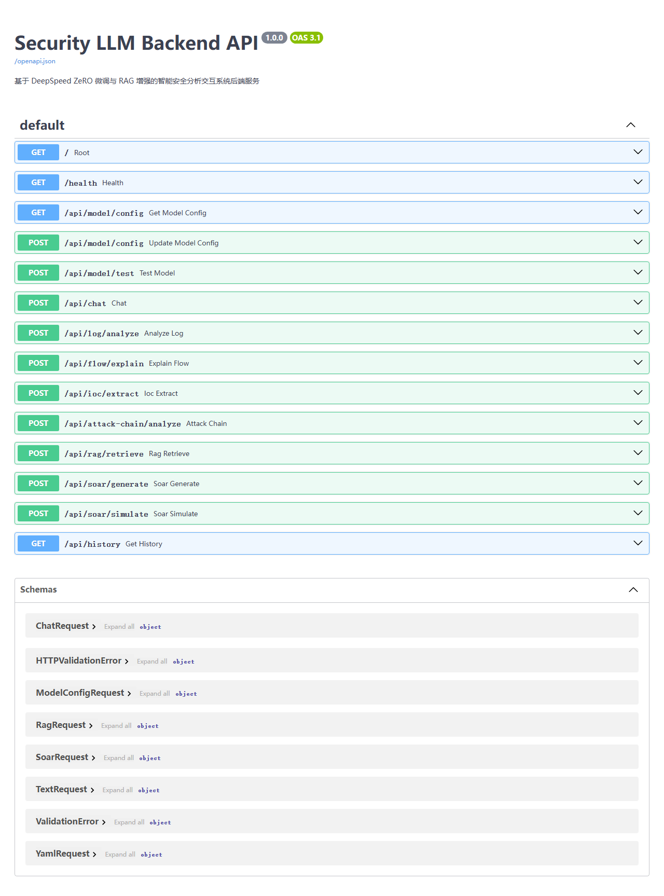
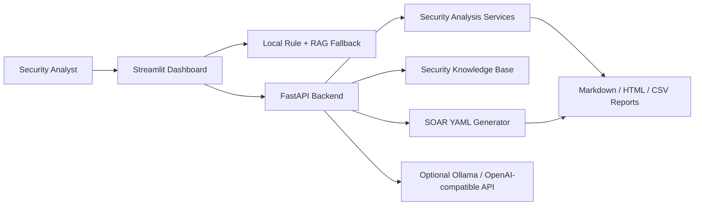

# Security LLM Platform

A defensive AI security analysis workbench for SOC-style triage: raw logs go in, evidence, IOCs, RAG context, attack-chain notes, SOAR playbooks and reports come out.

The default path runs locally without an LLM server, while FastAPI endpoints and optional model hooks show how the workflow can be extended.

## Why This Project Exists

Security AI demos often stop at a chat box. This project focuses on the workflow an analyst or maintainer can inspect:

1. preserve the input evidence,
2. explain why a finding was raised,
3. retrieve local security knowledge as a stable fallback,
4. expose the same behavior through APIs,
5. generate response plans without executing destructive actions.

## Project Signals

- **Backend/API**: FastAPI endpoints for health, chat, log analysis, IOC extraction, attack-chain analysis, RAG retrieval and SOAR simulation.
- **AI safety boundary**: default rule + RAG fallback; optional model providers are enhancement, not a dependency.
- **Security workflow**: SSH brute force, SQL injection, scan and C2-like findings are linked to evidence and response suggestions.
- **Automation discipline**: SOAR playbooks are YAML, simulated, and approval-aware for risky actions.
- **Maintainability**: CI, pytest coverage, release checks, docs and explicit limitations are included.
- **Research extension**: DeepSpeed ZeRO / LoRA scaffolding is documented as future experimental work, not overstated as production training.

## Screenshots

The app is intentionally moving away from a flashy AI dashboard toward a denser analyst workbench.



Additional screenshots can be generated during local review:

```text
docs/assets/workbench.png
docs/assets/dashboard.png
docs/assets/log-analysis.png
docs/assets/soar.png
docs/assets/api-docs.png
```

Suggested review flow: login -> load demo data -> workbench -> dashboard -> log analyzer -> SOAR generator -> FastAPI docs.

## Architecture



Default behavior is stable without a model server: the UI falls back to local rule-based analysis and RAG templates when the backend or model provider is unavailable.

## Quick Start

### 1. Create environment

```powershell
python -m venv .venv
.\.venv\Scripts\activate
pip install -r requirements.txt
```

Optional ML / vector / DeepSpeed dependencies:

```powershell
pip install -r requirements-ml.txt
```

### 2. Start the frontend

```powershell
streamlit run streamlit_app.py
```

Open:

```text
http://localhost:8501
```

### 3. Optional backend

```powershell
python -m uvicorn backend.main:app --host 127.0.0.1 --port 8000 --reload
```

Open API docs:

```text
http://127.0.0.1:8000/docs
```

## Demo Accounts

These accounts are for local demonstration only:

| Username | Password | Role |
|---|---|---|
| `admin` | `Admin#2026` | Full demo access |
| `analyst` | `Analyst#2026` | Analysis and response workflows |
| `researcher` | `Research#2026` | RAG, evaluation, and training demos |

Do not reuse these credentials in a real deployment.

## Core Workflows

1. Log in as `admin`.
2. Click **加载示例数据** to populate the dashboard.
3. Open **日志分析器** and load the mixed attack sample.
4. Review IOC extraction and attack-chain analysis.
5. Generate a SOAR YAML playbook and simulate execution.
6. Export Markdown / HTML / CSV reports.
7. Review the DeepSpeed ZeRO page as the optional research extension.

## API Overview

| Method | Endpoint | Purpose |
|---|---|---|
| `GET` | `/health` | Service health check |
| `GET` | `/api/model/config` | Read local model provider config |
| `POST` | `/api/model/config` | Update local model provider config |
| `POST` | `/api/model/test` | Test Ollama model connectivity |
| `POST` | `/api/chat` | RAG-assisted security assistant |
| `POST` | `/api/log/analyze` | Log analysis, IOC extraction, attack chain |
| `POST` | `/api/flow/explain` | Traffic summary explanation |
| `POST` | `/api/ioc/extract` | IOC extraction |
| `POST` | `/api/attack-chain/analyze` | Attack-chain reconstruction |
| `POST` | `/api/rag/retrieve` | Knowledge base lookup |
| `POST` | `/api/soar/generate` | Natural language to SOAR YAML |
| `POST` | `/api/soar/simulate` | Simulated SOAR execution |

More detail: [docs/API.md](docs/API.md)

## Quality Checks

```powershell
python scripts/check_project.py
pytest -q
```

These checks cover Python syntax, core smoke tests, API behavior, risky repository artifacts and common secret patterns.

## Defensive Security Boundary

This project is defensive and educational. It focuses on log triage, incident analysis, knowledge lookup, and simulated response planning. It should not be used to generate offensive exploitation steps, evasion logic, credential theft workflows, or destructive automation.

Generated SOAR actions are simulated by default. High-risk response actions such as blocking or isolation require manual approval in the generated playbook.

## Project Summary

Short description:

> Built a SOC-oriented AI security analysis platform with Streamlit and FastAPI, integrating rule-based threat detection, RAG security knowledge retrieval, IOC extraction, ATT&CK mapping, SOAR YAML playbook generation, report export, and optional local LLM integration. Designed the system to run offline with stable fallback behavior while exposing backend APIs for model and automation extensions.

## Documentation

- [Architecture](docs/ARCHITECTURE.md)
- [API Reference](docs/API.md)
- [Deployment Guide](docs/DEPLOYMENT.md)
- [Project Notes](docs/PROJECT_NOTES.md)
- [Usage Guide](USAGE_GUIDE.md)

## License

MIT License. See [LICENSE](LICENSE).
