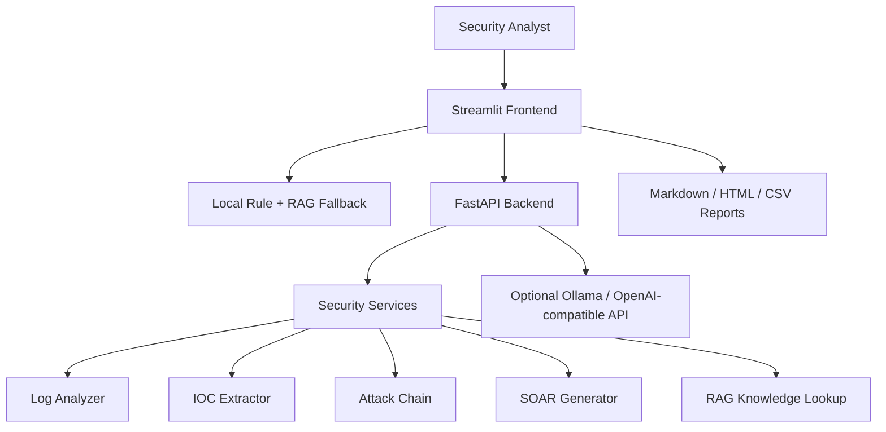

# Architecture

## Overview

Security LLM Platform is structured as a local-first SOC AI demo. The frontend is optimized for reviewer experience, while the backend exposes clean APIs that can be extended with real model services or persistence later.

## Runtime Modes

| Mode | Description | Requirement |
|---|---|---|
| Local fallback | Streamlit calls local Python functions directly | Core dependencies only |
| Backend mode | Streamlit calls FastAPI endpoints | Backend running on port 8000 |
| Optional model mode | Backend or frontend calls Ollama / OpenAI-compatible API | Local or remote model provider |

The UI remains usable when the backend or model provider is unavailable.

## Core Components

### Streamlit Frontend

`streamlit_app.py` provides the portfolio UI:

- login and role-based navigation
- SOC command center dashboard
- security assistant
- log, flow, IOC, attack-chain, ATT&CK, SOAR, incident, and report pages
- optional model configuration
- DeepSpeed ZeRO experiment presentation

### FastAPI Backend

`backend/main.py` exposes API endpoints for:

- health checks
- model provider configuration
- chat and RAG responses
- log and traffic analysis
- IOC and attack-chain extraction
- SOAR generation and simulation

### Security Services

`src/` and `backend/security_services.py` contain rule-based logic for detection, extraction, report generation, and response planning.

### Knowledge Base

`data/knowledge_base.md` is a lightweight local knowledge source used by the default RAG template mode. The optional vector RAG implementation lives under `src/rag/`.

### Training and Research Extensions

`training/`, `configs/`, and `src/deepspeed_optimizer/` hold LoRA / DeepSpeed-oriented experiment scaffolding. These modules are positioned as optional research extensions, not as a production training platform.

## Data Flow

1. Analyst enters logs, traffic summaries, or response requirements.
2. UI tries backend APIs when available.
3. If the backend fails, the UI falls back to local analysis functions.
4. Analysis results are shown in the UI and stored in local JSON runtime files.
5. Reports can be exported as Markdown, HTML, Word-compatible `.doc`, or CSV.

## Security Boundary

The project is defensive. Generated playbooks are simulated, and high-risk actions require manual approval.
